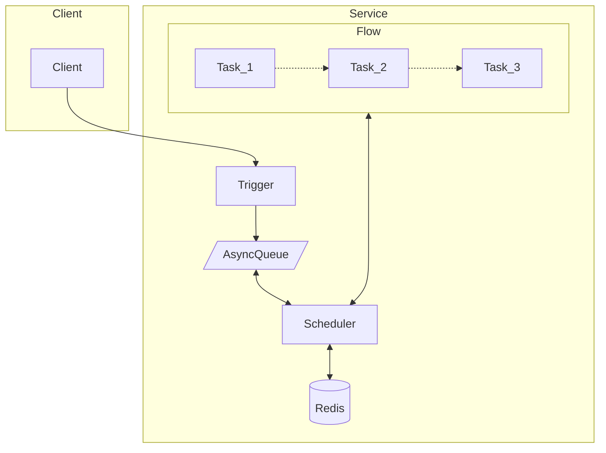

# Tick

方便的编写你的异步任务工作流。

灵感来自 [temporal](https://github.com/temporalio/temporal)

不同于 temporal，tick 不是一个全栈框架，temporal 有很多部署与维护成本（和开发成本），
而 tick 足够简单，它只依赖于 Redis。

## 特性

- 同步语法写异步逻辑，优雅面对复杂逻辑，不必为了延时任务破坏你的代码。
- 支持分布式调用
- 保证任务至少执行一次
- 自身足够简单可信耐，依赖 [asynq](https://github.com/hibiken/asynq) 实现延时任务。

## 如何工作



## TODO

- UI
  - 可视化流程，可视化任务状态，统计次数 （通过节点的方式）
  - 查看每个节点的执行结果

## Example

```go
func TestTick(t *testing.T) {
	tick := NewTick()

	wg := sync.WaitGroup{}
	wg.Add(1)

	flow := tick.Flow("demo")
	
	flow.
		Then("first", func(ctx context.Context) (tick.NextStatus, error) {
			v := tick.GetCallId(ctx)
			tick.Store(ctx, "first", v)
			return tick.NextStatus{}, nil
		}).
		Then("wait-for-second", func(ctx context.Context) (tick.NextStatus, error) {
			return tick.NextStatus{Status: "sleep", RunAt: time.Now().Add(2 * time.Second)}, nil
		}).
		Then("end", func(ctx context.Context) (tick.NextStatus, error) {
			return tick.NextStatus{}, nil
		}).
		Success(func(ctx context.Context, t tick.TaskStatus) error {
            fmt.Printf("[%v] fail exec at %v, task: %v", tick.GetCallId(ctx), time.Now().Sub(start), t)
            wg.Done()
			return nil
		}).
		Fail(func(ctx context.Context, t tick.TaskStatus) error {
			return nil
		})
	
	err := tick.Trigger(context.Backbround(), "demo")
	if err != nil {
		t.Fatal(err)
	}

	wg.Wait()
}
```

现在所有的 Task 将会按照顺序异步的各个节点中调度，并且你可以方便的添加睡眠时间。
