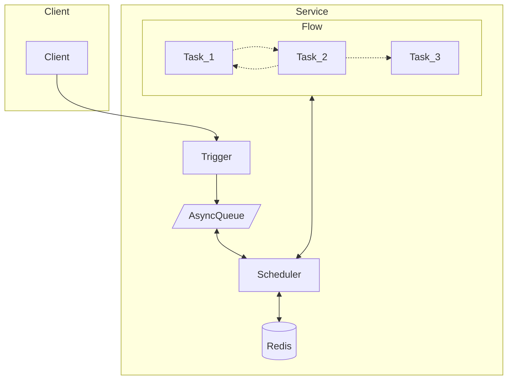

# GoTick

GoTick is a out-of-the-box workflow engine.

方便的编写你的异步工作流。

> 注意，此项目现在还是 Demo 状态。

灵感来自 [temporal](https://github.com/temporalio/temporal)。

不同于 [temporal](https://github.com/temporalio/temporal)，gotick 不是一个全栈框架。temporal 大而全，有部署成本和开发成本，而 gotick 只依赖于 Redis，足够简单方便使用。

## 特性

- 简单得像魔法一样的语法。
- 保证任务至少执行一次。
- 支持循环执行某个任务。
- 可终止任务。
- 支持分布式架构，支持在多个节点中调度任务。
- 只依赖于 Redis。
- 自身足够简单可信耐，依赖 [asynq](https://github.com/hibiken/asynq) 实现延时任务。

## 为什么不？

### 延时 MQ
- MQ 不能方便的组织多个依次执行的异步任务
- MQ 不方便的管理任务的状态，比如失败之后更新数据。

### AirFlow
- 慢

### [FastFlow](https://github.com/ShiningRush/fastflow)
- 使用代码还是太复杂了，我想让异步代码和同步代码一样简单。

## Example

### 订单超时关闭

在这个例子中将实现 "创建订单 3s 后关闭订单"，这个需求用 gotick 只需要几行代码。

```go
package main

import (
  "github.com/zbysir/gotick"
  "testing"
  "time"
)

func TestTick(t *testing.T) {
  tick := gotick.NewTickServer(gotick.Options{RedisURL: "redis://localhost:6379/0"})

  tick.Flow("demo/close-order", func(ctx *gotick.Context) error {
    startAt, _ := gotick.UseStatus(ctx, "start_at", time.Now())

    gotick.Sleep(ctx, "wait-close", 3*time.Second)

    gotick.Task(ctx, "close-order", func() error {
      log.Printf("close-order at %v", time.Now().Sub(startAt))
      return nil
    })
    return nil
  })
  
  callId, err := tick.Trigger(context.Background(), "demo/close-order", nil)
  if err != nil {
    t.Fatal(err)
  }

  t.Logf("callId: %+v", callId)

  e := tick.StartServer(ctx)
  if e != nil {
    t.Fatal(e)
  }
}

```

上面的 test 打印如下
```
=== RUN   TestTick
2023/04/20 23:37:18 close-order at 3.3092s
--- PASS: TestTick (3.55s)
```

当然 `gotick.Sleep` 并不是真正的让程序挂起，它是支持服务重启恢复的。

> Sleep 的精度不高的原因是 Asynq 的原因，你可以通过调整 [Asynq 的配置](https://pkg.go.dev/github.com/hibiken/asynq#Config:~:text=to%2015%20seconds.-,HealthCheckInterval,-time.Duration)来提高精度。

### 分段依次下载并上报进度

你有三种方法控制超时：
- 声明 Flow 时提供超时时间
- 触发 Flow 提供超时时间
- 在 Task 中自己判断并 gotick.Fail(ctx, errors.New("timeout"))

TODO 

### 分段并行下载并上报进度
TODO

## 如何工作

调度流程如下：


在用一个例子简单的说下程序是如何挂起的，这个例子实现了睡眠一段时间后打印一段信息：
```go
tick.Flow("demo/close-order", func(ctx *gotick.Context) error {
    startAt, _ := gotick.UseStatus(ctx, "start_at", time.Now())
    gotick.Sleep(ctx, "wait-close", 3*time.Second)

    log.Printf("wait end at %v", time.Now().Sub(startAt))
    return nil
  })
```

代码中 gotick.Sleep 方法会将当前任务挂起（当然不是真的 time.Sleep，而是通过 panic 中断运行），然后通过延时任务队列再次调度整个流程。

## 名词解释
- TickClient: 客户端，用于触发 Flow
- TickServer: 服务端，调度所有 Flow；也可以和 Client 一样触发 Flow
- Flow: 工作流，由多个 Task 组成
- Task: 任务，每一个任务需要有一个唯一的名字，Task 会从上至下依次执行。

一个 TickServer 包含多个 Flow，一个 Flow 包含多个 Task。

## API
| API        | 说明                           | 用途                                                | 举例  |
|------------|------------------------------|---------------------------------------------------|-----|
| UseMemo    | 运行任务并存储结果，如果任务失败会重试，直到成功或者超时 | 如果一个任务依赖另一个任务的结果，应该使用 UseMemo 缓存任务结果              || 
| Sleep      | 睡眠指定时间                       | 和 time.Sleep() 效果一样，不过不怕重启                        ||
| At         | 睡眠到指定时间                      | 和 Sleep() 类似，不过需要传递的是期望的运行时间||
| Task       | 运行一个任务                       | 如果一个任务不用返回数据，则可以使用 Task 代替 UseMemo                | |
| UseSquence | 返回一个序列， 这个序列可以用来执行循环逻辑       | 如果要循环执行一个任务就需要使用到 UseSquence                      | |
| UseArray   | 运行任务并存储数组结果                  | 如果一个任务返回的是一个数组，并且想要通过这个数组来循环执行一个任务就需要使用到 UseArray | |

> 也许你需要理解 [gotick 如何工作]才能更加理解这些 API 的目的。

## 计划

- 特性
  - [x] 使用 Golang 语法控制流程
  - [ ] 支持循环调度
  - [ ] goto 到某一个 task (考虑使用场景中)
  - [ ] 支持设置任务的超时时间，超时后调用 Fail 回调
  - [ ] 并行 task
    - 目前实现不太好实现并发，参考 https://github.com/ShiningRush/fastflow 可以更方便的做并发

- UI
  - 可视化流程，可视化任务状态，统计次数 （通过节点的方式）
    - 可参考 https://visualgo.net/zh 中的"网络流" 
    - https://algorithm-visualizer.org/branch-and-bound/binary-search-tree
  - 查看每个节点的执行结果
