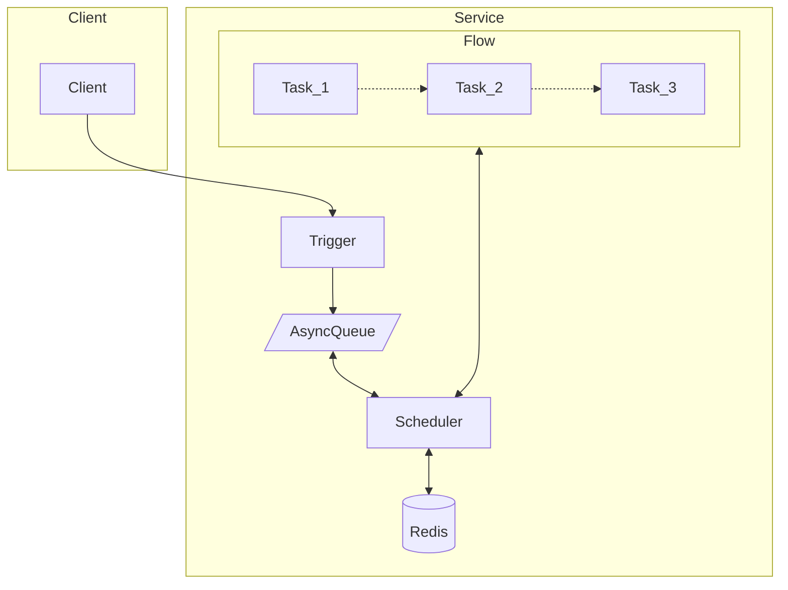

# GoTick

方便的编写你的异步任务工作流。

灵感来自 [temporal](https://github.com/temporalio/temporal)。

不同于 temporal，gotick 不是一个全栈框架，temporal 有很多部署与维护成本（和开发成本），
而 gotick 足够简单，它只依赖于 Redis。

## 特性

- 优雅编写异步逻辑，不必为了延时任务破坏你的代码。
- 支持分布式服务，在多个节点中调度任务。
- 保证任务至少执行一次。
- 自身足够简单可信耐，依赖 [asynq](https://github.com/hibiken/asynq) 实现延时任务。

## 如何工作



## 名词解释
- TickClient: 客户端，用于触发 Flow
- TickServer: 服务端，注册并运行所有 Flow；也可以和 Client 一样触发 Flow
- Flow: 工作流，由多个 Task 组成
- Task: 任务，每一个任务需要有一个唯一的名字，Task 会从上至下依次执行。

一个 TickServer 包含多个 Flow，一个 Flow 包含多个 Task。

## Example

```go
package main

import (
  "github.com/zbysir/gotick"
  "testing"
)

func TestTick(t *testing.T) {
  tick := gotick.NewTick(gotick.Options{RedisURL: "redis://localhost:6379/0"})

  flow := tick.Flow("demo")
  var start = time.Now()

  ctx, c := context.WithCancel(context.Background())

  flow.
          Then("first", func(ctx context.Context) (gotick.NextStatus, error) {
            t.Logf("first exec at %v", time.Now().Sub(start))
            v := gotick.GetCallId(ctx)
            gotick.Store(ctx, "first", v)
            return gotick.Done(), nil
          }).
          Then("wait-for-second", func(ctx context.Context) (gotick.NextStatus, error) {
            t.Logf("wait-for-second exec at %v", time.Now().Sub(start))
            return gotick.Sleep(2 * time.Second), nil
          }).
          Then("end", func(ctx context.Context) (gotick.NextStatus, error) {
            t.Logf("end exec at %v", time.Now().Sub(start))
            return gotick.Done(), nil
          }).
          Success(func(ctx context.Context, s gotick.TaskStatus) error {
            t.Logf("success exec at %v, task: %v", time.Now().Sub(start), s)
            c()
            return nil
          }).
          Fail(func(ctx context.Context, s gotick.TaskStatus) error {
            t.Logf("fail exec at %v, task: %v", time.Now().Sub(start), s)
            c()
            return nil
          })

  callId, err := tick.Trigger(context.Background(), "demo", nil)
  if err != nil {
    t.Fatal(err)
  }

  t.Logf("callId: %+v", callId)

  e := tick.StartServer(ctx)
  if e != nil {
    t.Fatal(e)
  }
}

```

上面的 test 打印如下
```
=== RUN   TestTick
    tick_test.go:296: callId: 8b9e2e2b86f0cb95e03578bc16ed4a31
    tick_test.go:264: first exec at 30.854133ms
    tick_test.go:270: wait-for-second exec at 1.037560007s
    tick_test.go:274: end exec at 3.044680989s
    tick_test.go:279: success exec at 4.045737576s, task: {done 0001-01-01 00:00:00 +0000 UTC [] 0}
--- PASS: TestTick (3.04s)
```

你可以看到所有的 Task 将会按照顺序**异步的在各个节点中调度**，并且你可以方便的**添加睡眠时间**。

> Sleep 的精度不高的原因是 Asynq 的原因，你可以通过调整 [Asynq 的配置](https://pkg.go.dev/github.com/hibiken/asynq#Config:~:text=to%2015%20seconds.-,HealthCheckInterval,-time.Duration)来提高精度。

## TODO

- UI
  - 可视化流程，可视化任务状态，统计次数 （通过节点的方式）
  - 查看每个节点的执行结果
