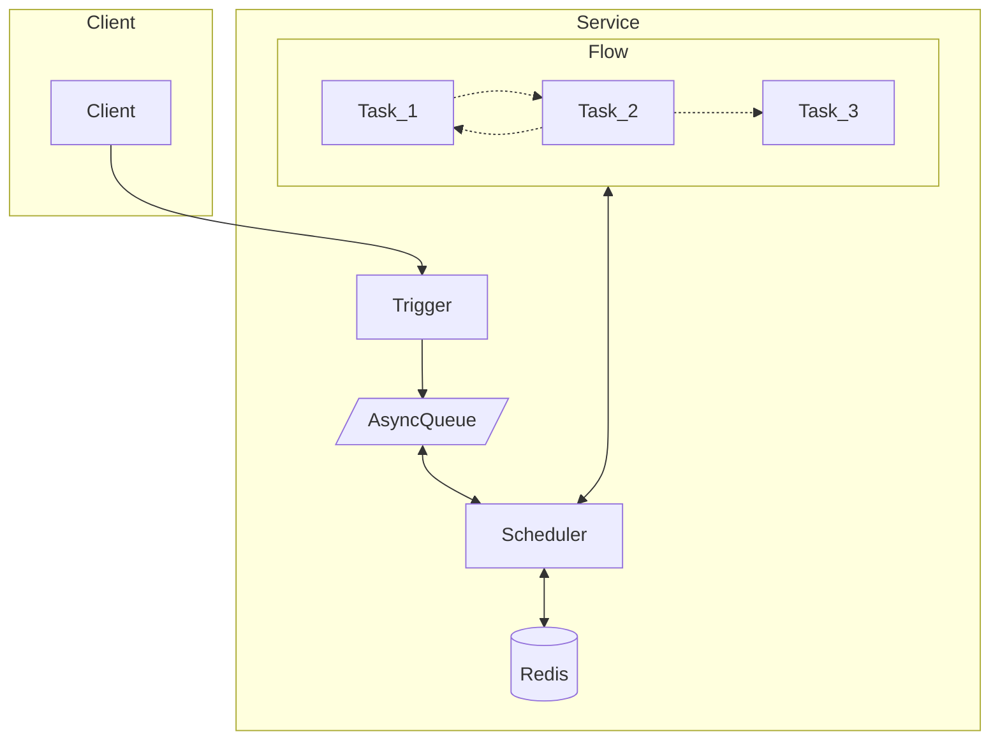

# GoTick

方便的编写你的异步任务工作流。

> 注意，此项目现在还是 Demo 状态。

灵感来自 [temporal](https://github.com/temporalio/temporal)。

不同于 temporal，gotick 不是一个全栈框架，temporal 大而全，有很多部署与维护成本（和开发成本），
而 gotick 只依赖于 Redis，部署足够简单。

## 特性

- 简单得像魔法一样的语法。
- 保证任务至少执行一次。
- 支持循环执行某个任务。
- 可终止任务。
- 支持分布式架构，支持在多个节点中调度任务。
- 只依赖于 Redis。
- 自身足够简单可信耐，依赖 [asynq](https://github.com/hibiken/asynq) 实现延时任务。

## 为什么不使用 MQ？
- MQ 不能方便的组织多个依次执行的异步任务
- MQ 不方便的管理任务的状态，比如失败之后更新数据。

## Example

### 订单超时关闭

在这个例子中将实现 "创建订单 3s 后关闭订单"，这个需求用 gotick 只需要几行代码。

```go
package main

import (
  "github.com/zbysir/gotick"
  "testing"
  "time"
)

func TestTick(t *testing.T) {
  tick := gotick.NewTickServer(gotick.Options{RedisURL: "redis://localhost:6379/0"})

  tick.Flow("demo/close-order", func(ctx *gotick.Context) error {
    startAt, _ := gotick.UseStatus(ctx, "start_at", time.Now())
    gotick.Sleep(ctx, "wait-close", 3*time.Second)

    gotick.Task(ctx, "close-order", func() error {
      log.Printf("close-order at %v", time.Now().Sub(startAt))
      return nil
    })
    return nil
  })
  
  callId, err := tick.Trigger(context.Background(), "demo/close-order", nil)
  if err != nil {
    t.Fatal(err)
  }

  t.Logf("callId: %+v", callId)

  e := tick.StartServer(ctx)
  if e != nil {
    t.Fatal(e)
  }
}

```

上面的 test 打印如下
```
=== RUN   TestTick
2023/04/20 23:37:18 close-order at 3.3092s
--- PASS: TestTick (3.55s)
```

当然 `gotick.Sleep` 并不是真正的让程序挂起，它是支持服务重启恢复的。

> Sleep 的精度不高的原因是 Asynq 的原因，你可以通过调整 [Asynq 的配置](https://pkg.go.dev/github.com/hibiken/asynq#Config:~:text=to%2015%20seconds.-,HealthCheckInterval,-time.Duration)来提高精度。

### 分段依次下载并上报进度

你有三种方法控制超时：
- 声明 Flow 时提供超时时间
- 触发 Flow 提供超时时间
- 在 Task 中自己判断并 gotick.Fail(ctx, errors.New("timeout"))

TODO 

### 分段并行下载并上报进度
TODO

## 如何工作

调度流程如下：


一个简单的例子是睡眠一段时间后打印一段信息：
```
tick.Flow("demo/close-order", func(ctx *gotick.Context) error {
    startAt, _ := gotick.UseStatus(ctx, "start_at", time.Now())
    gotick.Sleep(ctx, "wait-close", 3*time.Second)

    log.Printf("wait end at %v", time.Now().Sub(startAt))
    return nil
  })
```

在第一次运行时 gotick.Sleep 方法会通过 panic 终止整个流程，然后通过延时任务再次调度整个流程，而第二次运行流程时 gotick.Sleep 方法会执行成功并继续执行后面的语句。

## 名词解释
- TickClient: 客户端，用于触发 Flow
- TickServer: 服务端，调度所有 Flow；也可以和 Client 一样触发 Flow
- Flow: 工作流，由多个 Task 组成
- Task: 任务，每一个任务需要有一个唯一的名字，Task 会从上至下依次执行。

一个 TickServer 包含多个 Flow，一个 Flow 包含多个 Task。

## 计划

- 特性
  - [x] 使用 Golang 语法控制流 
  - [ ] 支持循环调度
  - [ ] goto 到某一个 task (考虑使用场景中)
  - [ ] 支持设置任务的超时时间，超时后调用 Fail 回调
  - [ ] 并行 task （考虑中）

- UI
  - 可视化流程，可视化任务状态，统计次数 （通过节点的方式）
  - 查看每个节点的执行结果
