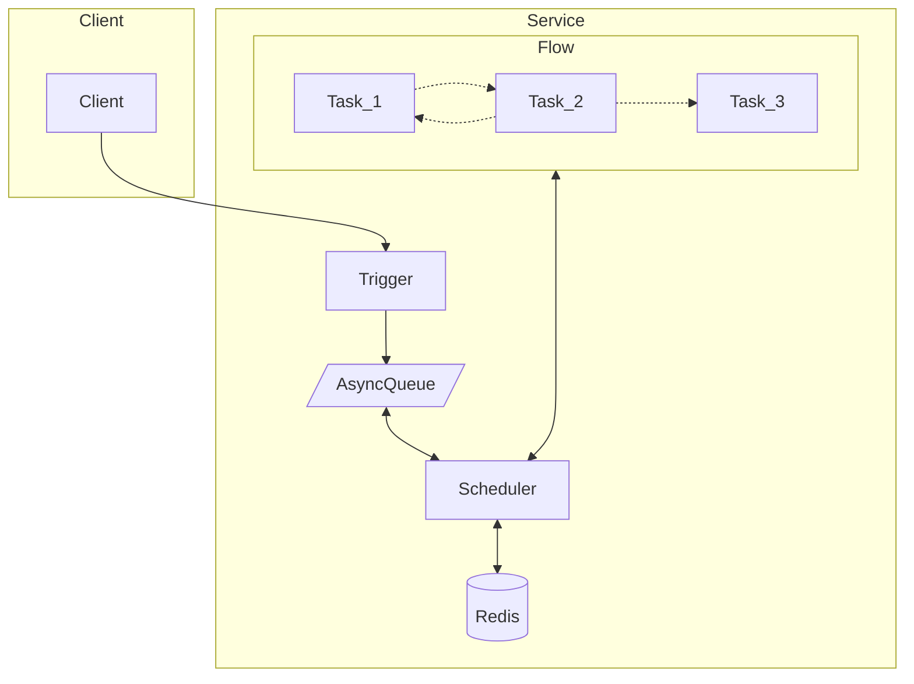

# GoTick

GoTick is a out-of-the-box workflow engine.

方便的编写你的异步工作流。

> 注意，此项目是一个探索项目，完全不能用于生产。

灵感来自 [temporal](https://github.com/temporalio/temporal)，不同于 temporal，gotick 不需要独立部署，直接在 golang 中使用即可。

temporal 大而全，有部署成本和开发成本，而 gotick 只依赖于 Redis，足够简单方便使用。

## 先看代码

在这个例子中将实现 常见的订单超时关闭需求："创建订单 3s 后关闭订单"。用 gotick 只需要几行代码。

```go
package main

import (
	"context"
	"log"
	"time"

	"github.com/zbysir/gotick"
)

func main() {
	tick, err := gotick.NewServerFromConfig(gotick.Config{
		RedisURL: "redis://localhost:6379/0",
	})
	if err != nil {
		log.Fatal(err)
	}

	tick.Flow("demo/close-order", func(ctx *gotick.Context) {
		startAt := gotick.Memo(ctx, "start_at", func() (time.Time, error) {
			return time.Now(), nil
		})

		gotick.Sleep(ctx, "wait-close", 3*time.Second)

		gotick.Task(ctx, "close-order", func(ctx *gotick.TaskContext) error {
			log.Printf("close-order at %v", time.Since(startAt))
			return nil
		})
	})

	ctx := context.Background()
	if _, err := tick.Trigger(ctx, "demo/close-order", nil); err != nil {
		log.Fatal(err)
	}

	log.Fatal(tick.StartServer(ctx))
}
```

运行代码打印如下

```
=== RUN   TestTick
2023/04/20 23:37:18 close-order at 3.3092s
--- PASS: TestTick (3.55s)
```

当然 `gotick.Sleep` 并不是简单的 `time.Sleep`，它是支持服务重启恢复的，后文会详细介绍。

更多例子可以查看 [example](./example/parallel_download) 目录。

## 重要：你的 Flow 函数会被反复重放

这是使用 gotick 前必须理解的唯一一件事。

gotick 没有把工作流序列化成状态机，而是**每次调度都从头重新执行你的 flow 函数**，
已完成的 Task 靠存在 Redis 里的状态被跳过。所以一个跑了 10 步的 flow，
它的函数体可能已经被执行了 10 次以上。

这意味着 flow 函数里、Task 之外的代码必须是**确定性**的——每次重放都得走同样的分支：

```go
tick.Flow("demo/bad", func(ctx *gotick.Context) {
    // ✗ 错：每次重放拿到的时间都不一样，可能走进不同分支
    if time.Now().Hour() > 12 {
        gotick.Task(ctx, "afternoon", ...)
    }

    // ✗ 错：每次重放都会真的查一次库，且结果可能变化
    user, _ := db.GetUser(id)

    // ✓ 对：用 Memo 把结果固化下来，重放时读缓存
    user := gotick.Memo(ctx, "user", func() (User, error) {
        return db.GetUser(id)
    })
})
```

规则很简单：**任何有副作用或结果可能变化的操作，都要放进 `Task` / `Memo` / `Array` 里。**
flow 函数本身只负责编排。

## 特性

- 简单得像魔法一样的语法。
- 支持分布式架构，支持在多个节点中调度任务。
- 只依赖于 Redis。
- 自身足够简单可信耐，依赖 [asynq](https://github.com/hibiken/asynq) 实现延时任务。

## 排查问题

流程卡住了想知道它停在哪一步，用 `gotick inspect`。它直接读 Redis，
不需要连上正在运行的 worker，也不需要部署任何东西：

```
$ go install github.com/zbysir/gotick/cmd/gotick@latest
$ gotick inspect -redis redis://localhost:6379/0 <callId>

callId  9f2ac41b8e7d
tasks   3

TASK        STATUS  RETRY  RUN AT                LAST ERROR
send-email  retry   1      2026-08-14T09:12:06Z  smtp timeout
start       done    0      -                     -
wait        sleep   0      2026-08-14T09:12:03Z  -

metadata
  name = bysir
```

callId 由 `Trigger` 返回，建议在业务侧记进日志。

## 为什么不？

### 延时 MQ

- MQ 只能实现单个任务调度，而不支持工作流。

### AirFlow

- 大，慢
- 需要写 python 代码

### [FastFlow](https://github.com/ShiningRush/fastflow)

- 使用代码还是太复杂了。
- 不想用 yaml 定义工作流，期望用代码定义工作流以得到更多的灵活性。

## 如何工作

### 名词解释

使用到的：

- `Client`: 客户端，只用于触发 Flow，不启动调度器。它和服务端之间没有直连，通过 Redis 通信。
- `Server`: 服务端，调度所有 Flow；也可以和 Client 一样触发 Flow。
- `Flow`: 定义一个工作流。
- `Task`: 任务，每一个任务需要有一个唯一的名字。

一个 TickServer 包含多个 Flow，一个 Flow 包含多个 Task。

内部逻辑：

- AsyncQueue：延时消息队列，用于触发调度器
- Scheduler：调度器，用于调度 Task
- KVStore：存储每个 Task 的状态

Task 的调度流程如下：


```mermaid
flowchart TB
  subgraph Service
    Trigger --> AsyncQueue
    AsyncQueue[/AsyncQueue/] <--> Scheduler
    Flow <----> Scheduler

    subgraph Flow
      direction LR
      Task_1 -.-> Task_2 -.-> Task_3
      Task_2 -.-> Task_1
      Task_3
    end

    Scheduler <--> Redis[(Redis)]
  end

  subgraph Client
    Client1[Client] --> Trigger
  end
```

### 如何实现中断并重新调度

用一个例子简单的说下程序是如何挂起的，这个例子实现了睡眠一段时间后打印一段信息：

```go
tick.Flow("demo/close-order", func(ctx *gotick.Context) {
    startAt := gotick.Memo(ctx, "start_at", func() (time.Time, error) {
        return time.Now(), nil
    })
    gotick.Sleep(ctx, "wait-close", 3*time.Second)

    log.Printf("wait end at %v", time.Since(startAt))
})
```

代码中 gotick.Sleep 方法会将当前任务中断（使用 panic），然后触发延时任务队列再次调度整个流程。

## API

### Task

运行一个不会返回数据的任务，如果任务失败会重试，直到成功或者超时；

如果任务需要返回数据，则应该使用 Memo

```go
gotick.Task(ctx, "start", func(ctx *gotick.TaskContext) error {
    log.Printf("start at %v", time.Now())
    return nil
})
```

### Memo

运行任务并缓存结果，如果一个任务需要返回数据给后续任务使用，那么应该使用 Memo 代替 Task。

```go
startAt := gotick.Memo(ctx, "start_at", func() (time.Time, error) {
    return time.Now(), nil
})
```

### Sleep

睡眠指定时间，和 time.Sleep() 效果一样，不过可服务重启。

```go
gotick.Sleep(ctx, "wait-close", 3*time.Second)
```

### Array

运行任务并存储数组结果，如果一个任务返回的是一个数组，并且想要通过这个数组来循环执行另一个任务，那么应该使用 Array 代替 Memo。

```go
tasks := gotick.Array(ctx, "split", func(ctx *gotick.TaskContext) ([]string, error) {
    return strings.Split(src, ""), nil
})
```

### Async

Async 生成一个异步任务，你需要使用 Wait 来执行这个异步任务。

### Wait

Wait 并行执行任务并等待任务执行完毕，可以限制并发数量，需要和 Async 方法一起使用。

```go
toEnF := gotick.Async(ctx, "to_en", func(ctx *gotick.TaskContext) (string, error) {
    log.Printf("[%s] execing to_en", time.Since(start))
    time.Sleep(2 * time.Second)
    return fmt.Sprintf("en(%s)", src), nil
})

lenF := gotick.Async(ctx, "token_len", func(ctx *gotick.TaskContext) (int, error) {
    log.Printf("[%s] execing token_len", time.Since(start))
    time.Sleep(2 * time.Second)
    return len(src), nil
})

gotick.Wait(ctx, 2, toEnF, lenF)
```

### AsyncArray

AsyncArray 是 使用 Array 生成 Async 数组的简写形式，用于方便的生成多个并行任务。

```go
tasks := gotick.Array(ctx, "split", func(ctx *gotick.TaskContext) ([]string, error) {
    return strings.Split(src, ""), nil
})

fs := gotick.AsyncArray(ctx, "download", tasks, func(ctx *gotick.TaskContext, v string, index int) (string, error) {
    log.Printf("[%s] execing download(%v)", time.Since(start), v)
    time.Sleep(2 * time.Second)
    return fmt.Sprintf("download(%s)", v), nil
})

gotick.Wait(ctx, 4, fs...)
```

## 计划

- 特性

  - [x] 使用 Golang 语法控制流程
  - [x] 支持循环调度
  - [ ] 支持设置工作流和单个任务的超时时间，超时后调用 Fail 回调
  - [x] 并行 task
  - [ ] 支持中间件以方便的添加 Trace 与 Metrics

- [x] 优化调度

  - 目前后台调度依赖一个异步任务队列，任务队列中没有优先级概念，意味着如果当并发量很大的时候，所有等待调度的任务会被平等的循环调度，但期望执行到一半的任务被优先调度，保证已经在执行的任务能尽可能快的完成。
  - [x] 可选方案：已经开始的任务的再次调度事件将发送到优先级更高的队列中，只有当他们执行完成了，才会开始调度新的任务。

- [ ] UI

  - 可视化流程
    - 可视化 Task 状态
      - 可参考 https://visualgo.net/zh 中的"网络流"
      - react-flow
      - https://algorithm-visualizer.org/branch-and-bound/binary-search-tree
  - 查看每个 Task 的执行结果

- [ ] DOC
  - 解释代码运行流程：
    - https://metaflow.org/ 首页有可参考的实现
    - https://lit.dev/
